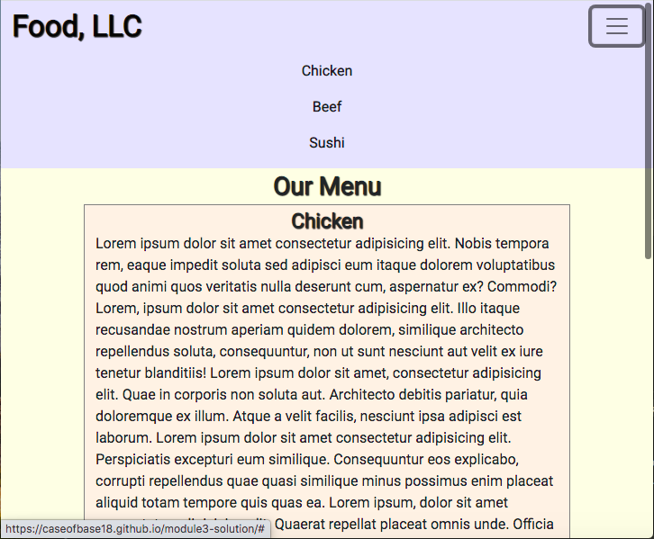

# Dropdown Menu

This is a basic layout for a restaurant menu that includes a responsive navbar with a dropdown menu.  The entire layout is responsive through the use of media queries and Bootstrap components.  The navbar only features the brand name in the top left corner when in desktop and tablet view.  When in mobile view, a button appears in the top right corner of the navbar.  Once the button is clicked, a dropdown menu featuring three items appears below the navbar. This website uses HTML5, CSS3, and Bootstrap.

Deployed: https://caseofbase18.github.io/module3-solution/

## Desktop and Tablet View

## Mobile View

